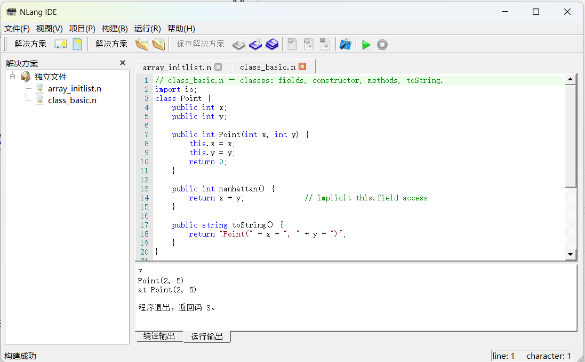

# NLang

NLang is a scripting language compiler and IDE, extracted from a game engine I
previously developed, as a standalone teaching/research open-source project.



The NLang IDE: solution tree on the left (projects plus standalone `.n`
files), editor in the middle, build and execution output below. The UI
follows the system locale (Chinese and English are bundled).

## Quick Start

The fastest way to deploy and learn NLang is the prebuilt Windows release —
no toolchain, no build:

1. **Download** the installer `NLang-<version>-win64.exe` (or the portable
   `NLang-<version>-win64.zip`) from the
   [releases page](https://github.com/dliting/nlang/releases).
2. **Install** — run the installer (defaults to `C:\Program Files\NLang`, adds
   a Start Menu entry for the IDE; expect a UAC prompt). No installation
   preferred? Unzip the portable archive to any writable folder and run
   `bin\nide.exe`.
3. **Read the manual** — launch **NLang IDE** and open its **Help menu**: the
   complete documentation site ships in the package and works fully offline.
   The *Getting Started* chapters walk the language, the CLI and the IDE one
   topic per page, with runnable example programs.
4. **Run something** — open the bundled `examples/` in the IDE and press Run
   (copy them to a writable folder first — a build writes its `.nmod` next to
   the source). `examples/README.md` indexes every example.

The executables link the MSVC runtime dynamically — install the
[VC++ Redistributable](https://aka.ms/vs/17/release/vc_redist.x64.exe) if
Visual Studio 2022 is not on the machine.

Building from source instead? The rest of this page covers that.

## Build Dependencies

| Dependency | Version | Required | Notes |
|------------|---------|----------|-------|
| CMake | 3.16+ | Yes | Build system |
| C++ Compiler | C++17 | Yes | MSVC 19.44+ / GCC 9+ / Clang 10+ |
| Flex | 2.6+ | Yes (dev) | Lexer generator. Windows: [win_flex_bison](https://github.com/lexxmark/winflexbison) |
| Bison | 3.0+ | Yes (dev) | Parser generator. Windows: [win_flex_bison](https://github.com/lexxmark/winflexbison) |
| Python3 | 3.13+ | Optional | Build scripts. Conda `py313` env recommended on Windows |
| Qt5 | 5.15+ | IDE only | Core, Xml, Widgets modules |
| LLVM | 15+ | Optional | Code generation backend (`-DNLANG_ENABLE_LLVM=ON`) |

### Windows Development Setup

1. Install Visual Studio 2022 with C++17 support
2. Download [win_flex_bison](https://github.com/lexxmark/winflexbison) and place
   `flex.exe` and `bison.exe` in a known directory (e.g. `C:\dev\win_flex_bison\`)
3. Configure with explicit Flex/Bison paths:
   ```bash
   cmake -B build -DFLEX_EXE="C:/dev/win_flex_bison/flex.exe" \
                  -DBISON_EXE="C:/dev/win_flex_bison/bison.exe"
   ```
4. Python3 is used by build scripts and — with the default
   `NLANG_BUILD_DOCS=ON` — by the mkdocs docs site (`pip install -r
   tools/docs-requirements.txt`, interpreter selectable via
   `-DNLANG_DOCS_PYTHON=<path>`; docs off with `-DNLANG_BUILD_DOCS=OFF`).
   `-DPYTHON3_EXECUTABLE=<path>` overrides the build-script interpreter.

## Building

```bash
cmake -B build
cmake --build build
```

### Build Options

| Option | Default | Description |
|--------|---------|-------------|
| `-DNLANG_ENABLE_LLVM` | OFF | Enable LLVM code generation backend |
| `-DNLANG_BUILD_IDE` | OFF | Build the Qt5 IDE (nide) |
| `-DNLANG_BUILD_TESTS` | OFF | Build unit tests |
| `-DNLANG_BUILD_DOCS` | ON | Build the mkdocs documentation site |
| `-DNLANG_DOCS_PYTHON` | `python` | Interpreter running mkdocs (see `tools/docs-requirements.txt`) |
| `-DFLEX_EXE` | auto | Path to flex executable |
| `-DBISON_EXE` | auto | Path to bison executable |
| `-DPYTHON3_EXECUTABLE` | auto | Python3 path for build scripts |

### Known Flex/Bison Issues on Windows

- **`unistd.h` inclusion**: Flex 2.6 `%option nounistd` does not prevent
  `<unistd.h>` inclusion in generated header files. We handle this with
  `YY_NO_UNISTD_H` compile definition in CMakeLists.txt.
- **`INT8_MIN` macro redefinition**: Flex generates `INT8_MIN/MAX` macros
  in a non-C99 fallback branch. MSVC's `<stdint.h>` also defines them,
  causing C4005 warnings. We handle this with `%top{ #include <stdint.h> }`
  in `nlang.l`, which includes `<stdint.h>` before flex's definitions,
  so the `#ifndef` guards skip the conflicting macros.

## Command-line Tools

```text
ncc <source.n> [-o out.nmod] [-I <dir>...]        Compile and execute
ncc build <source.n> [-o out.nmod] [-I <dir>...]  Compile only
ncc -p <project.nproj> [-o out.nmod] [-I ...]     Compile and execute a project
ncc build -p <project.nproj> [-o out.nmod]        Compile a project
ncc run <module.nmod>                             Execute only
```

### Debugging

```text
ndb <module.nmod>   Debug a compiled module (initial stop at the first
                    statement, like gdb `start`)
```

Commands: `b <file.n:LINE | LINE | funcName>` set a breakpoint (a bare
`LINE` resolves in the current frame's file), `i b` list breakpoints,
`d <id>` delete, `c` continue, `s`/`n`/`f` step into/over/out, `bt`
backtrace, `frame <n>` select a frame, `info locals`, `p <name>` print
one local, `l [line]` source window, `x` disassembly of the selected
frame, `catch on|off` break on throw (default off), `q` quit — stdin EOF
behaves like `q`. When the program finishes, ndb prints
`Program exited with code N.` and exits with that same code.

For embedding, `ndb --machine <module.nmod>` exposes the same session
over a tab-separated line protocol on stdin/stdout — the nide debugger
is built on it. The engine-side layering is described in
`docs/vm-architecture/debugging.md`.

All command-line tools report their version with `--version`
(e.g. `ncc (NLang) <version>`). The IDE shows it in Help → About, and the
documentation site in its footer.

Multi-source projects are described by a `.nproj` XML file (see
`examples/hello_project/`):

```xml
<?xml version="1.0" encoding="UTF-8"?>
<Project name="hello_project" namespace="hello_project">
  <Sources>
    <File path="main.n"/>
    <File path="utils.n"/>
  </Sources>
</Project>
```

`name` is the output module name (defaults to the file stem), `outputDir`
optionally redirects the `.nmod` (relative to the project file), and `File`
paths are relative to the project file's directory.

## Modules and Imports

Cross-file references are explicit: an `import` declares which modules a
file may call, and the compiler rejects anything else (same-directory
files are the one exception — they see each other implicitly). Three
import sources share one syntax:

| Source | Module path | Example |
|---|---|---|
| Project file | dotted path relative to the `.nproj` | `utils/helper.n` → `import utils.helper;` |
| External `.nmod` | file stem (single segment) | `lib.nmod` → `import lib;` |
| Built-in namespace | `io` / `math` / `fs` | `import io;` |

| Reference | Import needed? | Call form |
|---|---|---|
| Same file | no | bare |
| Same directory, other files | no (implicit) | bare or qualified |
| Cross-directory, same project | **yes** | qualified only (`utils.helper.f()`) |
| External `.nmod` | **yes** | qualified only (`lib.f()`) |
| Built-in `io`/`math`/`fs` | **yes** | qualified (`io.print`) |

This matrix covers root-level functions. Members of a namespace shared
across directories are the one v1 exception — unreachable from another
directory in any form (see the Declarations chapter, Import Declaration).

A wildcard import is a recursive prefix match: `import utils.*;` reaches
`utils/` and every nested subdirectory (`utils.helper`, `utils.sub.x`).
Calls still use the full path — there is no `from m import *` form.
Duplicate and overlapping imports are idempotent.

An unimported reference fails with a pointed diagnostic, e.g.
`Module 'utils.helper' is not imported. Add 'import utils.helper;' (or 'import utils.*;') at the top of this file.`
Full semantics — resolution order, reserved path segments, single-file
mode — are in the Declarations chapter
(`docs/language-spec/declarations.md`, Import Declaration).

## Standard Library (Phase 11)

`math`, `io` and `fs` are built-in namespaces — reserved names that need
an explicit `import` before their qualified calls. Strings carry built-in
methods:

```n
import io;
import math;
import fs;

int main() {
    io.print(math.sqrt(2.0));                     // 1.41421
    string s = "hello world".substring(0, 5);     // "hello" (byte offsets)
    List<string> words = "a,b,c".split(",");      // 3 elements
    fs.makeDirs("out");
    io.writeFile(fs.join("out", "greet.txt"), s);
    if (!fs.exists("out/greet.txt")) return 1;
    return words.length();
}
```

Full details — parameter type policy, exception mapping, byte semantics,
deterministic PRNG — are in the Standard Library chapter
(`docs/language-spec/standard-library.md`); runnable copies of the example
live in `examples/stdlib_*.n`.

New to NLang? The `docs/getting-started/` chapters walk the language, the
CLI and the IDE one topic per page (they are also reachable from the nide
Help menu); `examples/README.md` indexes every runnable example.

## IDE (nide)

```bash
cmake -B build-ide -DNLANG_BUILD_IDE=ON \
    -DCMAKE_PREFIX_PATH=<path-to-qt5.15>
cmake --build build-ide --config Release
```

The build output in `build-ide/src/tools/nide/Release/` is a runnable
layout: the Qt runtime DLLs, the `platforms/` plugin directory, and the
`ncc`/`nvm`/`ndb` tools are copied next to `nide.exe` (the IDE invokes
them from its own directory), so that folder can be copied elsewhere
as-is.
The UI language follows the system locale (Chinese and English are
bundled; untranslated strings fall back to their authored text).

Files created through 文件 → 新建文件 join the selected project in the
solution tree (or the solution's sole project); files rename in place
via F2 or the tree/tab context menus (an open dirty editor is saved to
the old path first), the splitter layout persists across sessions, and
文件 → 最近打开 remembers recent solutions, projects, and files.

Standalone `.n` files opened through 文件 → 打开 (no project needed)
appear in a “独立文件” tree group and can be built and run directly:
the module lands under `%TEMP%\nlang-nide\`, and Run auto-rebuilds it
when the source changed. The Help menu shows the bundled documentation
site (`docs/site`) in an embedded viewer inside the IDE.

nide also ships a built-in debugger (driving `ndb --machine` under the
hood; a walkthrough lives in `docs/getting-started/debugging.md`). F5
starts a debug session — the program runs to the first breakpoint or to
completion — and Shift+F5 stops it at any time: the stop is a hard
terminate, so an infinite loop or a stuck native call never blocks the
IDE. Breakpoints toggle with F9 or a gutter click (a gutter dot starts
hollow and turns filled once the live session confirms the line is in
the compiled module), persist across sessions and follow file renames.
While paused, the 调试 page in the output area shows the call stack
(click a frame to jump there and refresh locals), the frame's locals,
and a 抛异常时中断 switch that breaks at every throw site.

| 动作 | 快捷键 |
|------|--------|
| 启动调试 / 继续 | F5 |
| 运行（不调试） | Ctrl+F5 |
| 停止调试 | Shift+F5 |
| 切换断点 | F9 |
| 单步跳过 | F10 |
| 单步进入 | F11 |
| 单步跳出 | Shift+F11 |

`ctest -C Release -R nide_deploy_check` verifies the self-containment: it copies
the layout to a scratch directory, pins Qt's search paths to it via
`qt.conf`, and runs the IDE test suite from there.

## Documentation Site

The user manual (`docs/*.md`) is rendered into a static site by the CMake
target `nlang_docs` (on by default, `-DNLANG_BUILD_DOCS=OFF` to skip) into
`<build>/docs/site/`; the IDE's Help menu shows that directory in its
embedded viewer. Toolchain versions are pinned in
`tools/docs-requirements.txt` (`pip install -r tools/docs-requirements.txt`,
then configure with `-DNLANG_DOCS_PYTHON=<interpreter>`).

The pipeline lives in `tools/nlang-docs/`, a self-contained package that is
not installed — run it straight from the source tree via `PYTHONPATH`
(env-prefix syntax as in Git Bash; on PowerShell/cmd use the
`cmake -E env PYTHONPATH=... <python> ...` idiom the CMake recipe itself
uses):

```bash
# Iteration preview (plain mkdocs live-reload server)
PYTHONPATH=tools/nlang-docs/src python -m nlang_docs serve --config mkdocs.yml

# What the CMake target runs: mkdocs build --strict, the offline-search
# inlining, then the audits below
PYTHONPATH=tools/nlang-docs/src python -m nlang_docs build \
    --config mkdocs.yml --site-dir build/docs/site \
    --ncc build/src/tools/ncc/Release/ncc.exe \
    --nvm build/src/tools/nvm/Release/nvm.exe

# Audit an already-generated site (also reused by packaging verification)
PYTHONPATH=tools/nlang-docs/src python -m nlang_docs check \
    --site-dir build/docs/site --config mkdocs.yml

# Audit one page's ```nlang snippets standalone (compile + run + exit code)
PYTHONPATH=tools/nlang-docs/src python -m nlang_docs snippets \
    --doc docs/getting-started/first-program.md --ncc <ncc> --nvm <nvm>
```

`build` chains four stages: the mkdocs build, offline search inlining, the
site audit, and — when `--ncc`/`--nvm` are known, which the CMake target
always passes — a snippet audit that compiles and runs every ```nlang
program in the getting-started guide and compares the process exit code
against the one the snippet promises, so a language change that breaks a
documented example fails the docs build.

The site must render fully offline, straight from `file://`: URLs stay flat
(`use_directory_urls: false`), webfonts are disabled, nothing loads from a
CDN, and the build inlines the search index into
`search/search_index.js` itself (mkdocs-material's offline plugin would do
it, but it injects a CDN polyfill from unpkg, so the pipeline hand-rolls
the inlining — see `tools/nlang-docs/src/nlang_docs/offline_search.py`).
The `check` audit enforces that shape: internal
links must resolve to existing `.html` files, `#fragments` must exist,
directory-form links are rejected, the set of built pages must equal
the `nav` of the `mkdocs.yml` passed via `--config` (missing and
unreachable pages both fail), and no `script[src]`/`link[href]` may
reference http(s) — the site must load with no network at all. Unit
tests: `pytest tools/nlang-docs/tests` (also wired into ctest as
`nlang_docs_pytest`).

## Packaging (Windows)

Release packages are produced with CPack from the IDE build tree (it contains
all tools; a tools-only tree cannot ship `nide`):

```bash
cmake -B build-ide -DNLANG_BUILD_IDE=ON \
    -DFLEX_EXE=<flex> -DBISON_EXE=<bison> \
    -DCMAKE_PREFIX_PATH=<path-to-qt5.15> \
    [-DNLANG_NSIS_MAKENSIS=C:/path/to/makensis.exe]
cmake --build build-ide --config Release
cd build-ide && cpack -C Release -B ../release
```

This produces `release/NLang-<version>-win64.zip` (portable) and
`release/NLang-<version>-win64.exe` (NSIS installer; requires NSIS 3.03+ —
either on `PATH` or passed via `-DNLANG_NSIS_MAKENSIS`). Both contain the
same layout: `bin/` with `nide`, `ncc`, `nvm`, `ndisasm`, `ndb` and the Qt runtime,
plus `examples/`, the generated documentation site (`docs/site/`), `LICENSE`,
`CHANGELOG.md` and `README.md`. The installer defaults to
`C:\Program Files\NLang` and adds a Start Menu shortcut for the IDE.

Notes:

- The installer defaults to `C:\Program Files\NLang`, which standard users
  cannot write to. Copy `examples/` to a writable folder before opening them
  in the IDE — a build writes its `.nmod` next to the project file.
- The executables link the MSVC runtime dynamically; targets need the
  [VC++ Redistributable for Visual Studio](https://aka.ms/vs/17/release/vc_redist.x64.exe)
  (already present on machines with Visual Studio 2022).
- `python tests/packaging/verify_package.py` checks a built package:
  extracts the zip, asserts the layout, audits the packaged docs site with
  the `nlang_docs check` pipeline, and smoke-tests the packaged toolchain
  by compiling and running `examples/hello.n` with it.

## Project Structure

```
include/nlang/runtime/     - Runtime public headers
include/nlang/compiler/    - Compiler public headers
include/nlang/vm/          - VM public headers (.nmod format constants)
src/runtime/               - Runtime implementation
src/compiler/              - Compiler implementation (grammar, generated, builder)
src/vm/                    - VM backend implementation
src/tools/ncc/             - Command-line compiler
src/tools/nvm/             - VM runner
src/tools/ndisasm/         - Bytecode disassembler
src/tools/ndb/             - Debugger
src/tools/nide/            - Qt5 IDE
src/3rdparty/tinyxml2/     - Vendored tinyxml2 10.1.0 (.nproj parsing)
```

## License

MIT
